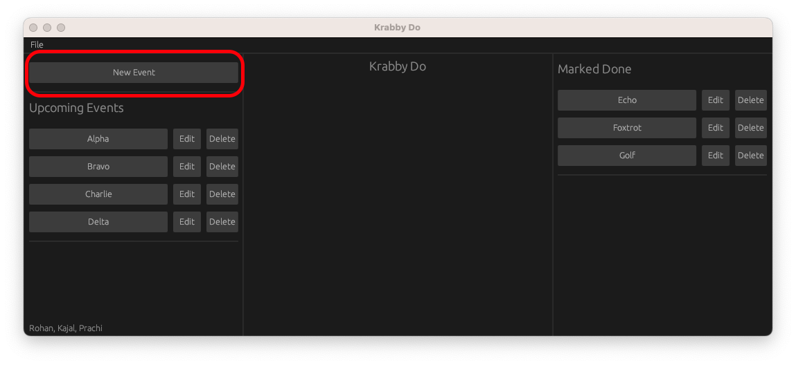
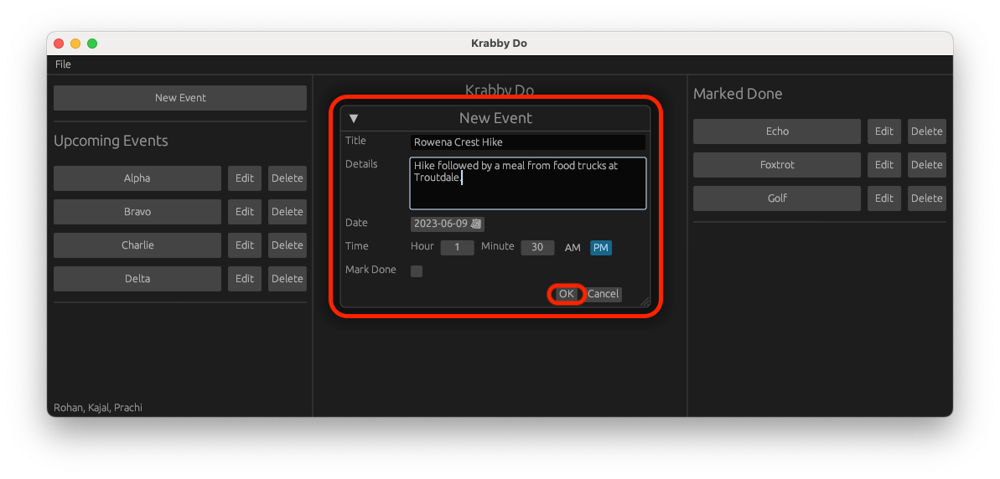
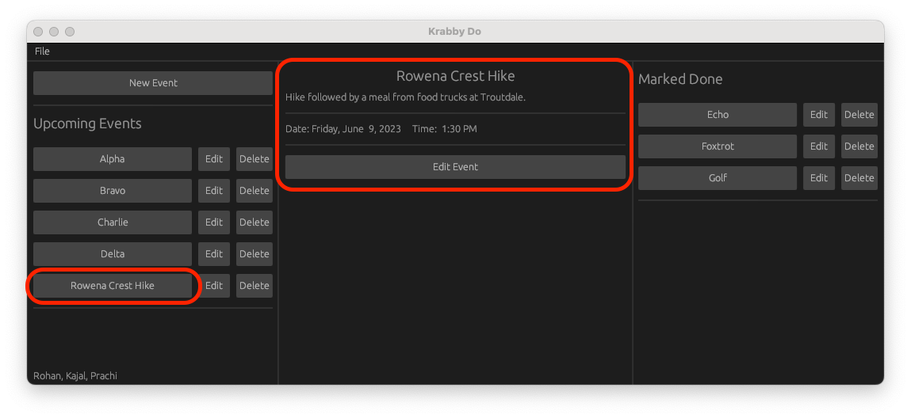
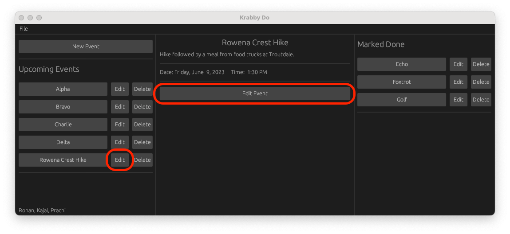
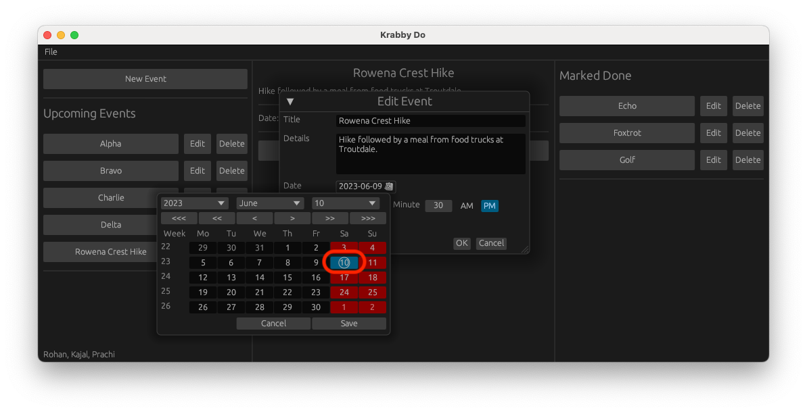
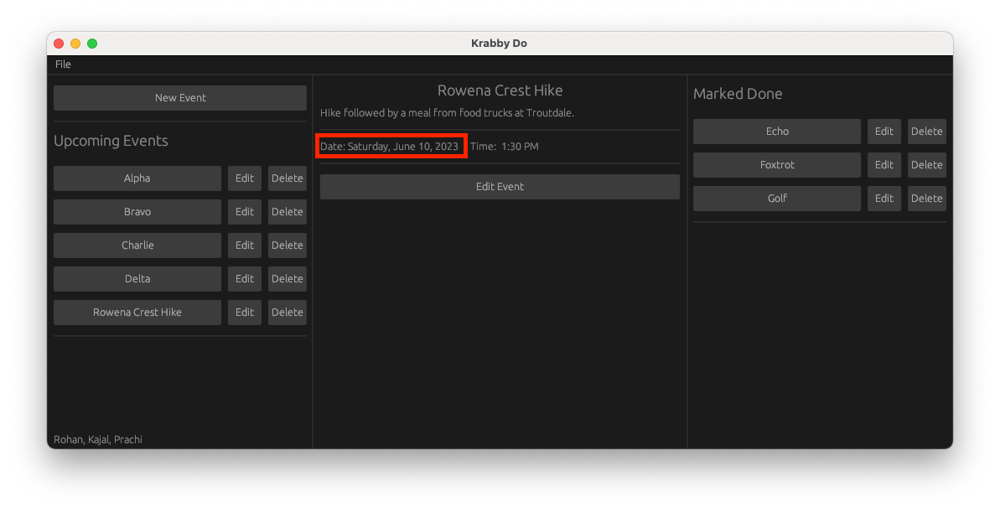
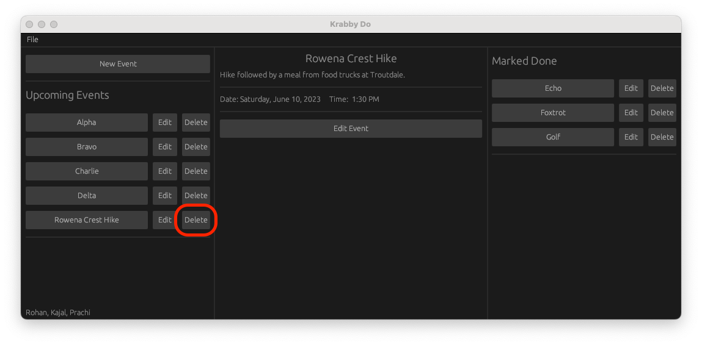
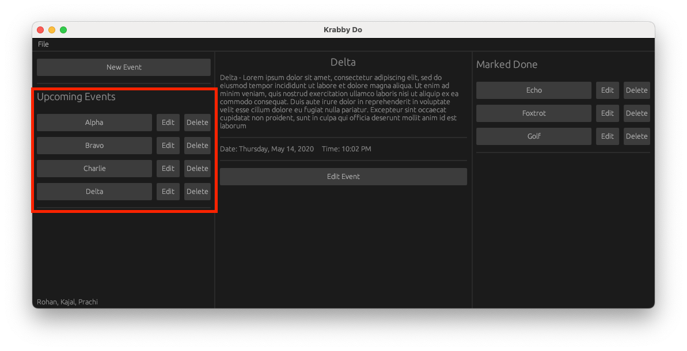

# How to use Krabby Do

1. To create a new event, click the New Event button.
   

---

2. Enter details into the New Event dialog box, then click OK to add a new event or task.
   

---

3. The event is now added to the list. To view the event, click on it to display the details in the middle panel.
   

---

4. Click on the Edit button on either the event list or the event details to start editing the event.
   

---

5. Edit the details as required and click OK to edit that event.
   

---

6. The central panel displays the updated details of the event.
   

---

7. To delete an event, click on the delete button in the event list and it will be deleted.
   

---

8. The list gets updated on deleting an event.
   

---
